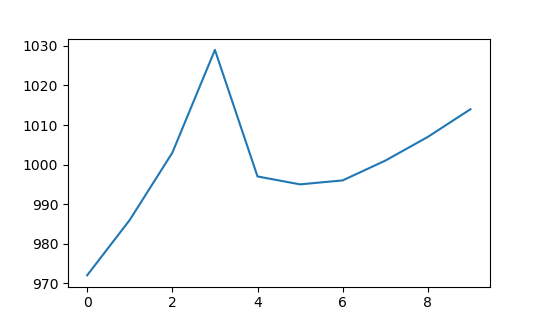

Running main.py on i5-5200U processor:

Running main.py on Ryzen 5 7500F:

For whatever reason, on the Intel chip, the RDTSC operation returns even results the vast majority of the time, whereas the AMD chip returns proper pseudo-random number generation as expected. Can anyone explain the disparity between the results on the two chips?
